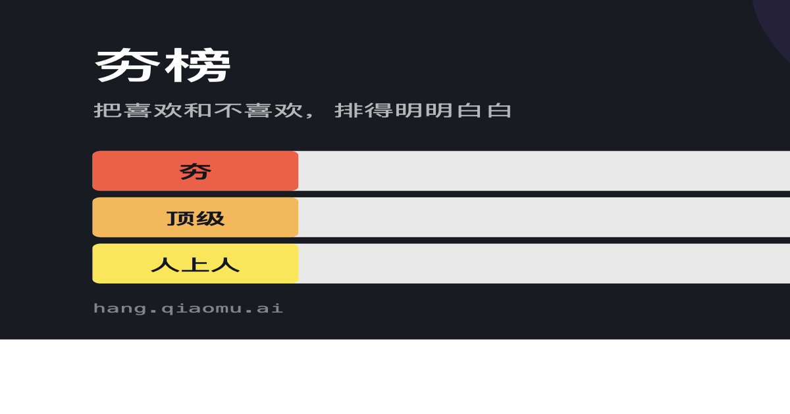
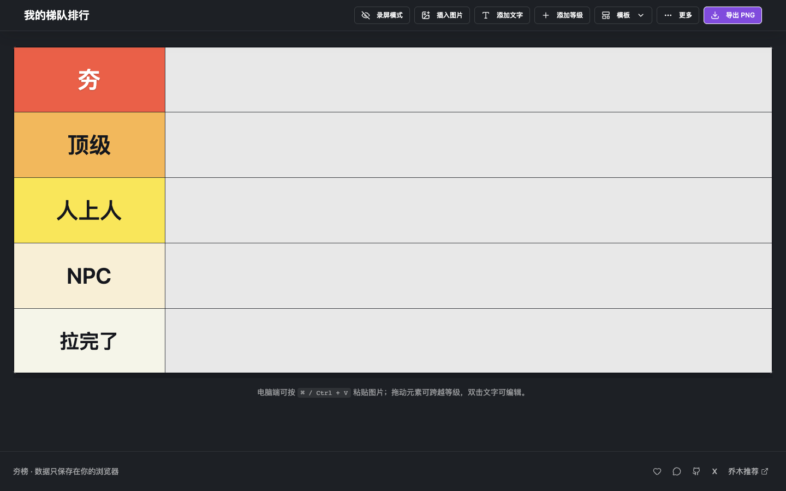
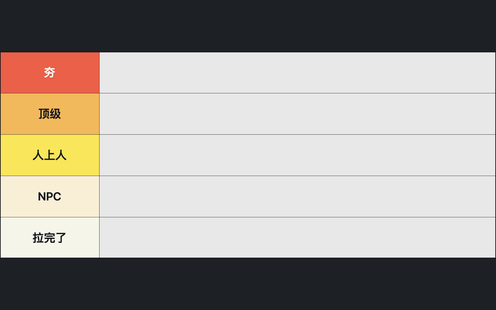

# 夯榜 HangBang

**中文** | [English](#english)



> 免费、无需登录的中文 Tier List 梯队图生成器：粘贴图片，自由拖拽，编辑等级，一键导出高清 PNG。
>
> A free, no-sign-up Tier List maker for pasting images, arranging tiers, and exporting high-resolution PNGs.

[](https://hang.qiaomu.ai/)
[](https://github.com/joeseesun/hangbang/actions/workflows/ci.yml)
[](LICENSE)

**已验证：** 2026-08-20 通过 TypeScript、ESLint、生产构建及桌面/移动端浏览器验收；线上版本可直接使用。

## 这是什么

夯榜是一个浏览器内完成的 Tier List 创作工具，适合游戏角色排行、产品盘点、美食评级、内容选题和社群趣味榜单。图片与画布数据默认只保存在你的浏览器中，不需要注册账号，也不需要上传到服务器。

👉 [立即制作一张梯队图](https://hang.qiaomu.ai/)

## 核心能力

| 能力 | 你能得到什么 |
| --- | --- |
| 图片上传与粘贴 | 上传本地图片，或在电脑端直接按 `⌘ / Ctrl + V` 粘贴 |
| 自由画布 | 图片和文字可跨等级拖动、缩放、调整层级 |
| 等级编辑 | 修改等级名称、颜色、字号、行高和顺序 |
| 预设模板 | 夯系列、标准 SABCD、游戏角色、美食评级等模板 |
| 录屏模式 | 一键隐藏工具栏、说明和编辑控件，只保留榜单画面 |
| 高清导出 | 在浏览器内生成并下载 PNG |
| 本地保存 | 使用 IndexedDB，并以 localStorage 作为兼容兜底 |
| PWA | 支持安装到桌面，已配置 manifest 与 service worker |

## 产品截图

### 编辑模式



### 录屏模式



## 快速开始

### 最快路径

直接访问 [hang.qiaomu.ai](https://hang.qiaomu.ai/)，无需安装。

### 本地运行

```bash
git clone https://github.com/joeseesun/hangbang.git
cd hangbang
npm install
npm run dev
```

开发服务器默认运行在 `http://localhost:8001`。

### 生产构建

```bash
npm run typecheck
npm run lint:eslint
npm run build
```

可独立部署的静态文件位于 `dist/site/`，可托管到 Nginx、GitHub Pages 或任意静态文件服务。

## 使用方式

1. 选择一个等级模板，或直接编辑默认「夯 / 顶级 / 人上人 / NPC / 拉完了」。
2. 点击「插入图片」，也可以直接粘贴剪贴板图片。
3. 拖动图片与文字完成排行，按需调整大小、颜色和层级。
4. 录屏时点击「录屏模式」；按 `Esc` 或使用右上角退出区域回到编辑状态。
5. 点击「导出 PNG」下载最终图片。

## 隐私与边界

- 图片、文字和榜单结构默认保存在当前浏览器，不会作为画布内容上传到夯榜服务器。
- 公共演示站使用自托管 Umami 统计匿名访问；统计脚本仅对 `hang.qiaomu.ai` 生效。
- 浏览器清理站点数据后，本地榜单可能无法恢复，请及时导出成品。
- 超大图片或大量图片会受到浏览器内存和本地存储容量限制。
- 电脑端粘贴、拖拽和录屏体验最佳；移动端主要用于轻量编辑与查看。

## 技术栈

- React 19 + TypeScript
- Vite 8 + Tailwind CSS 4
- Radix UI / shadcn/ui + Lucide
- `html2canvas-pro` PNG 导出
- IndexedDB + localStorage 本地持久化
- Nginx 静态托管

## 项目结构

```text
src/
├── pages/HomePage/       # 主编辑页面
├── components/           # 画布、工具栏与公共组件
├── data/templates.ts     # 预设模板
├── hooks/useTierList.ts  # 榜单状态与操作
└── lib/                  # 图片处理与本地持久化
public/                   # PWA、SEO 与品牌资源
scripts/                  # 开发和独立构建脚本
```

## 参与贡献

欢迎提交问题与改进建议。开始前请阅读 [CONTRIBUTING.md](CONTRIBUTING.md)；安全问题请按 [SECURITY.md](SECURITY.md) 私下报告。

## 关于向阳乔木

由 [向阳乔木](https://qiaomu.ai/) 制作。

- Blog：[blog.qiaomu.ai](https://blog.qiaomu.ai/)
- 乔木推荐：[tuijian.qiaomu.ai](https://tuijian.qiaomu.ai/)
- X：[@vista8](https://x.com/vista8)
- GitHub：[@joeseesun](https://github.com/joeseesun/)
- 微信公众号：向阳乔木推荐看

## License

[MIT License](LICENSE)

---

<a name="english"></a>

# HangBang — Tier List Maker

HangBang is a free browser-based Tier List maker for creators, gamers, communities, and anyone who wants to turn opinions into a clear visual ranking.

## Try it

Open the verified live app: [hang.qiaomu.ai](https://hang.qiaomu.ai/)

No account is required. Paste or upload images, move them across tiers, edit labels and colors, switch to a clean recording view, and export the result as a high-resolution PNG.

## Features

- Upload and clipboard image paste
- Free-position image and text elements
- Editable tier labels, colors, font sizes, heights, and ordering
- Built-in Chinese and standard S/A/B/C/D templates
- Clean recording mode with editing controls hidden
- Local browser persistence with IndexedDB and localStorage fallback
- Client-side PNG export
- Installable PWA

## Run locally

```bash
git clone https://github.com/joeseesun/hangbang.git
cd hangbang
npm install
npm run dev
```

The development server runs at `http://localhost:8001` by default.

## Verify and build

```bash
npm run typecheck
npm run lint:eslint
npm run build
```

Deploy the static output from `dist/site/`.

## Privacy and limits

Canvas images and data stay in the current browser by default. The hosted demo uses a self-hosted Umami script for anonymous traffic analytics, restricted to `hang.qiaomu.ai`. Clearing site data may remove saved boards. Very large image sets are limited by browser memory and storage quotas.

For help and contribution guidance, see [CONTRIBUTING.md](CONTRIBUTING.md) and [SECURITY.md](SECURITY.md).

Copyright (c) 向阳乔木. Released under the [MIT License](LICENSE).
